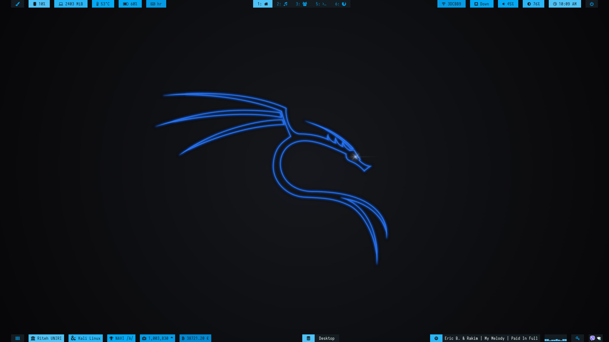
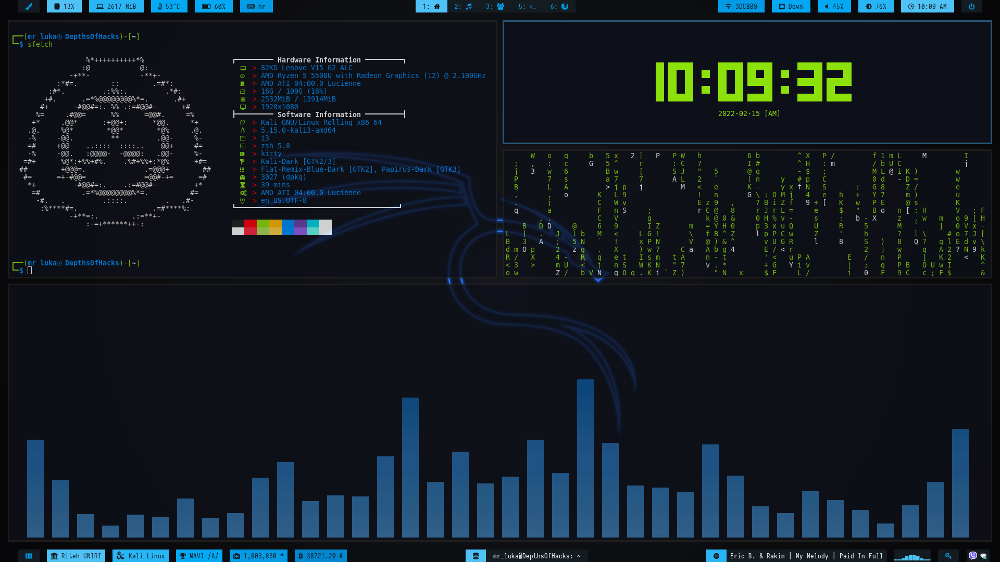

# Dotfile for Kali Linux [i3-gaps]

## A description of what the project is for.
- My second attempt at ricing Linux, after I did Mint 20.2. Inspiration came from https://www.reddit.com/r/unixporn/ .  - I want to learn ethical hacking so that's why I chose Kali.

## Screenshots

## Specifications

- Distro: `Kali GNU/Linux Rolling x86_64`
- WM: `i3-gaps`
- Bar: `Polybar`
- Shell: `zsh 5.8`
- Text editor: `Vim`
- File manager: `thunar`
- Terminal: `kitty`
- Compositor: `compton` [ for background transparency ]
- Terminal apps: `neofetch`, `tty-clock`, `cmatrix`, `cava`
- Wallpaper link: https://www.wallpaperflare.com/kali-linux-kali-linux-nethunter-unix-lenovo-chrome-neon-wallpaper-yhfbr/download/1920x1080
